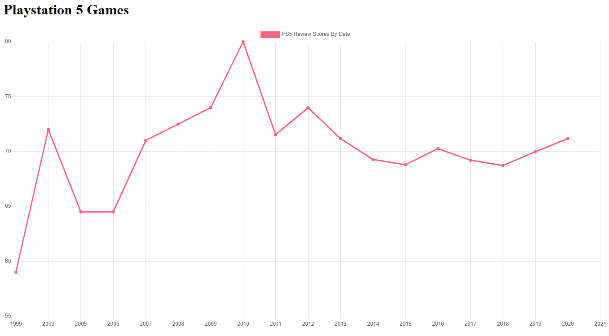

# Data Science Experiments

These are just some ongoing tests I'm doing for fun to learn a little more about data science and gaining insights on large sets of data. This involves me scraping some data, etc. Don't take of this seriously. Its just for fun and this repo will be chaotic.

### My First Experiment
I scraped some Review Data from Open Critic API to build out some data sets of review scores on Video Games for PS5 broken down by the game's release date year to see what kinds of trends we've had with gaming releases year over year. It's not perfect, and there are some bugs with it so I'm going to come back and play with it more later.

